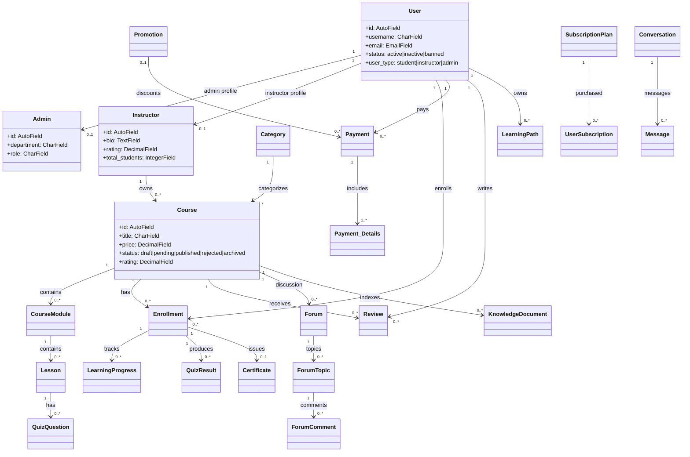

# Thông Tin Xây Dựng Class Diagram

Tài liệu này được tổng hợp từ source hiện tại của dự án tại `course/` và `course_fe/`.
Nguồn chính: `course/config/settings.py`, các file `models.py`, `urls.py`, `services.py`, `views.py`, `course_fe/package.json`, `course_fe/src/stores/auth.store.ts`.

Lưu ý: trong repo có các file DBML như `course/db_full_nodjango.dbml` và `course/dbml_grouped/*.dbml`. Một phần DBML có dấu hiệu cũ hơn code hiện tại, ví dụ còn bảng QnA/QnAAnswers trong khi app/file model tương ứng đang bị xóa hoặc không nằm trong `INSTALLED_APPS`. Tài liệu này ưu tiên Django app registry/model code hiện tại.

## 1. Thông Tin Tổng Quan Dự Án

- Tên dự án/hệ thống: Udemy Clone Website / Online Course Platform.
- Hệ thống gì: Hệ thống học trực tuyến kiểu marketplace khóa học, cho phép học viên tìm kiếm, mua/đăng ký khóa học, học bài, làm quiz, nhận chứng chỉ; giảng viên tạo khóa học và theo dõi doanh thu; admin quản trị nền tảng.
- Mô tả chức năng chính: quản lý người dùng, khóa học, danh mục, module/bài học, ghi danh, giỏ hàng, thanh toán VNPAY/MoMo, khuyến mãi, subscription, học tập/quiz/chứng chỉ, đánh giá, blog/forum/comment, chat realtime, support ticket, learning path AI, transcript/knowledge base.
- Phạm vi diagram đề xuất: toàn hệ thống ở mức high-level, sau đó tách diagram chi tiết theo module backend/domain model.
- Ngôn ngữ lập trình:
  - Backend: Python.
  - Frontend: TypeScript/React.
- Framework/thư viện chính:
  - Backend: Django 5.2, Django REST Framework 3.16, Django Channels, daphne, channels-redis, cloudinary, SimpleJWT/PyJWT, django-cors-headers.
  - Database: SQLite khi local không có `DATABASE_URL`; hỗ trợ PostgreSQL qua `dj-database-url`/`psycopg2-binary`.
  - Frontend: React 18, Vite, Zustand, TanStack React Query, Radix UI, lucide-react, i18next.
  - Tích hợp ngoài: VNPAY, MoMo, Cloudinary, Google Gemini, OpenAI embedding/chat config, local Whisper transcript.

## 2. Actors / Người Dùng

- Guest/Khách vãng lai:
  - Xem trang chủ, danh mục, tìm kiếm khóa học, xem chi tiết khóa học, xem blog/forum public, xem pricing.
  - Đăng ký, đăng nhập, xác thực email, reset password.
- Student/User/Học viên:
  - Quản lý hồ sơ và cài đặt tài khoản.
  - Thêm giỏ hàng/wishlist, mua khóa học, đăng ký subscription, yêu cầu hoàn tiền.
  - Ghi danh khóa học, học bài, cập nhật tiến độ, làm quiz, xem kết quả, tải chứng chỉ.
  - Đánh giá khóa học, bình luận bài học/blog/forum, chat, nhận thông báo, tạo support ticket.
  - Dùng AI learning path advisor.
- Instructor/Giảng viên:
  - Có mọi quyền cơ bản của học viên.
  - Tạo/sửa/xóa khóa học, module, lesson, attachment, quiz/test case.
  - Theo dõi dashboard, analytics, học viên, review, doanh thu, payout.
  - Quản lý phương thức nhận payout, đồng ý/không đồng ý đưa khóa học vào subscription, tạo thông báo cho học viên.
- Admin:
  - Quản lý user/admin/instructor, phân quyền FE, khóa/mở user.
  - Quản lý danh mục, khóa học, approval/moderation, blog/forum/review/report.
  - Quản lý payment/refund, promotion, subscription plan, homepage/system settings, activity logs.
  - Duyệt hồ sơ đăng ký giảng viên, quản lý form đăng ký, duyệt payout, vận hành job subscription/transcript.
- External systems:
  - VNPAY/MoMo: cổng thanh toán, IPN/return URL, refund.
  - Cloudinary: upload media, video/image storage.
  - Gemini/OpenAI/local Whisper: learning path advisor, knowledge assistant, transcript/embedding.

Frontend đang ánh xạ role trong `auth.store.ts`:
- `unknown`: quyền đọc blog cơ bản.
- `user`: profile, enroll course, review, comment, blog read, follow.
- `instructor`: quyền user + tạo/sửa/xóa course, quản lý lesson, earnings, students, blog, analytics.
- `admin`: toàn bộ quyền.

## 3. Chức Năng Chính / Use Cases

- Tài khoản & xác thực: register, login, Google login, refresh token, logout, verify email, reset password, change password, update profile/settings, deactivate/delete account.
- Quản trị user/role: admin tạo/sửa/xóa user, tạo admin, ban/unban, xem activity log.
- Catalog khóa học: CRUD category, instructor, course, module, lesson, attachment; publish/archive course; search/filter course; xem course detail.
- Học tập: enroll course, kiểm tra quyền truy cập, theo dõi learning progress, thống kê học viên, xem lesson player.
- Quiz/assessment: tạo question/test case, lấy quiz theo lesson, submit quiz, tính điểm, lưu lịch sử/kết quả.
- Giỏ hàng/wishlist/payment: thêm/xóa cart, áp mã giảm giá, tạo payment record, tạo thanh toán VNPAY/MoMo, xử lý IPN/return, xem status, refund.
- Subscription: tạo plan, gắn course vào plan, user subscribe/cancel, track usage, admin extend/cancel/expire, instructor consent.
- Promotion: CRUD promotion, áp dụng cho course/category, validate promotion code.
- Review/community: review course, report/moderate review, blog post/comment, forum/topic/comment, report/moderate topic/message.
- Chat/realtime: direct/group conversation, message, attachment, reaction, read state, participant role, pin message, block user, WebSocket notification/chat/comment.
- Support: tạo support ticket, admin xử lý ticket, reply.
- Instructor finance: tính earning, request payout, admin approve/reject payout, payout methods.
- Certificate: issue/generate/download/verify/revoke certificate.
- AI & transcript: tạo learning path bằng advisor, lưu path conversation, generate/edit/publish transcript, chunk transcript, ingest knowledge document/chunk, assistant conversation/message.

## 4. Công Cụ / Format Diagram Đề Xuất

- Format nên dùng: Mermaid `classDiagram` vì có thể render trực tiếp trong Markdown/GitHub/VS Code.
- Mức độ chi tiết:
  - High-level: dùng cho báo cáo/tổng quan.
  - Detailed: tách theo module, tránh một diagram duy nhất quá rối.
- Có nên chia nhiều diagram không: Có. Dự án có hơn 60 domain model, nên chia thành các diagram:
  - Accounts/Roles/Profile.
  - Catalog/Courses/Instructors.
  - Learning/Assessment/Certificate.
  - Payment/Promotion/Subscription.
  - Instructor Revenue/Payout.
  - Community/Blog/Forum/Review.
  - Chat/Notification/Support.
  - AI/Learning Path/Transcript/Knowledge.
  - Admin/System/Registration/Application/Activity Log.

## 5. Mermaid High-Level Starter



## 6. Quy Ước Access Modifier

- Django model fields là public theo convention Python, nên trong UML dùng dấu `+`.
- Không thấy custom abstract base model cho entity domain.
- Các helper/service function bắt đầu bằng `_` là private/internal theo convention Python.
- Các API class kế thừa `APIView`; serializer kế thừa `serializers.ModelSerializer` hoặc `serializers.Serializer`.
- Method chính của domain model rất ít; phần lớn behavior nằm trong `services.py`, `views.py`, provider class và payment/refund service.

## 7. Catalog Entities / Objects Chính

Quy ước đọc nhanh:
- `PK`: khóa chính.
- `FK->app.Model`: khóa ngoại.
- `OneToOne->app.Model`: quan hệ 1-1.
- `ManyToMany->app.Model`: quan hệ n-n.
- `null/blank`: optional.
- Access mặc định: `public (+)`.

### Accounts / Roles / Profile

- `users.User` (`Users`): `id:Auto PK`, `username:Char unique`, `email:Email unique`, `password_hash:Char`, `full_name:Char`, `phone:Char?`, `avatar:Char?`, `address:Char?`, `created_at:DateTime`, `updated_at:DateTime`, `deleted_at:DateTime?`, `deleted_by:FK->users.User?`, `is_deleted:Boolean`, `last_login:DateTime?`, `status:Char`, `user_type:Char`.
- `users.RefreshToken` (`RefreshTokens`): `id:BigAuto PK`, `user:FK->users.User`, `jti:Char unique`, `created_at:DateTime`, `expires_at:DateTime`, `revoked_at:DateTime?`, `replaced_by:OneToOne->users.RefreshToken?`; methods: `is_active()`, `revoke()`.
- `users.UserSettings` (`UserSettings`): `id:BigAuto PK`, `user:OneToOne->users.User`, `account_preferences:JSON`, `notification_preferences:JSON`, `privacy_preferences:JSON`, `created_at:DateTime`, `updated_at:DateTime`.
- `admins.Admin` (`Admin`): `id:Auto PK`, `user:OneToOne->users.User?`, `department:Char`, `role:Char`, `created_at:DateTime`, `updated_at:DateTime`, `deleted_at:DateTime?`, `deleted_by:FK->users.User?`, `is_deleted:Boolean`.
- `activity_logs.ActivityLog` (`activity_logs`): `id:Auto PK`, `user:FK->users.User?`, `action:Char`, `description:Text?`, `entity_type:Char?`, `entity_id:Integer?`, `ip_address:GenericIPAddress?`, `created_at:DateTime`, `trace_id:UUID?`, `user_agent:Text?`.
- `search.SearchEvent` (`SearchEvents`): `id:BigAuto PK`, `user:FK->users.User?`, `raw_query:Char`, `normalized_query:Char`, `source:Char`, `created_at:DateTime`.

### Catalog / Instructor / Course

- `instructors.Instructor` (`Instructors`): `id:Auto PK`, `user:OneToOne->users.User?`, `bio:Text?`, `specialization:Char?`, `qualification:Char?`, `experience:Integer?`, `social_links:JSON?`, `rating:Decimal`, `total_students:Integer`, `total_courses:Integer`, `payment_info:JSON?`, `level:FK->InstructorLevel?`, audit fields.
- `instructor_levels.InstructorLevel` (`InstructorLevels`): `id:Auto PK`, `name:Char unique`, `description:Text?`, `min_students:Integer`, `min_revenue:Decimal`, `commission_rate:Decimal`, `plan_commission_rate:Decimal`, `min_plan_minutes:Integer`, audit fields.
- `categories.Category` (`Categories`): `id:Auto PK`, `name:Char unique`, `description:Text?`, `icon:Char?`, `parent_category:FK->Category?`, `status:Char`, timestamps.
- `courses.Course` (`Courses`): `id:Auto PK`, `title:Char`, `shortdescription:Char?`, `description:Text?`, `instructor:FK->Instructor?`, `category:FK->Category?`, `subcategory:FK->Category?`, `thumbnail:Char?`, `price:Decimal`, `discount_price:Decimal?`, `discount_start_date:DateTime?`, `discount_end_date:DateTime?`, `level:Char`, `language:Char`, `duration:Integer?`, `total_lessons:Integer`, `total_modules:Integer`, `requirements:Text?`, `learning_objectives:JSON`, `target_audience:JSON`, `skills_taught:JSON`, `prerequisites:JSON`, `tags:JSON`, `promotional_video:Char?`, `status:Char`, `is_featured:Boolean`, `is_public:Boolean`, publish/stat/audit fields.
- `coursemodules.CourseModule` (`CourseModules`): `id:Auto PK`, `course:FK->Course?`, `title:Char`, `description:Text?`, `order_number:Integer`, `duration:Integer?`, `status:Char`, audit fields.
- `lessons.Lesson` (`lessons_lesson`): `id:Auto PK`, `coursemodule:FK->CourseModule`, `title:Char`, `description:Text?`, `content_type:Char`, `content:Text?`, `video_url:Char?`, `video_public_id:Char?`, `file_path:Char?`, `duration:Integer?`, `is_free:Boolean`, `order:Integer`, `status:Char`, audit fields.
- `lesson_attachments.LessonAttachment` (`LessonAttachments`): `id:Auto PK`, `lesson:FK->Lesson?`, `title:Char?`, `file_path:Char`, `file_type:Char?`, `file_size:Integer?`, `download_count:Integer`, audit fields.

### Learning / Assessment / Certificate

- `enrollments.Enrollment` (`Enrollments`): `id:Auto PK`, `user:FK->User`, `course:FK->Course?`, `payment:FK->Payment?`, `source:Char`, `subscription:FK->UserSubscription?`, `enrollment_date`, `expiry_date`, `completion_date`, `progress:Decimal`, `status:Char`, `certificate:Char?`, `certificate_issue_date`, `last_access_date`, audit fields; constraint: `unique_enrollment`.
- `learning_progress.LearningProgress` (`LearningProgress`): `id:Auto PK`, `user:FK->User`, `enrollment:FK->Enrollment`, `course:FK->Course`, `lesson:FK->Lesson`, `progress_percentage:Decimal`, `last_accessed`, `status`, `start_time?`, `completion_date?`, `time_spent?`, `last_position?`, `is_completed`, `notes?`, audit fields; constraint: `unique_user_lesson_progress`.
- `quiz_questions.QuizQuestion` (`QuizQuestions`): `id:Auto PK`, `lesson:FK->Lesson`, `difficulty:Char`, `question_text:Text`, `question_type:Char`, `options:JSON?`, `correct_answer:Text`, `points:Integer`, `explanation:Text?`, `order_number?`, `description?`, code quiz fields, audit fields.
- `quiz_questions.QuizTestCase` (`QuizTestCases`): `id:Auto PK`, `question:FK->QuizQuestion`, `input_data:Text`, `expected_output:Text`, `is_hidden:Boolean`, `points:Integer`, `order_number:Integer`, timestamps, soft delete.
- `quiz_results.QuizResult` (`QuizResult`): `id:Auto PK`, `enrollment:FK->Enrollment`, `lesson:FK->Lesson`, `start_time?`, `submit_time?`, `time_taken?`, `total_questions?`, `correct_answers?`, `total_points?`, `score?`, `answers:JSON?`, `passed:Boolean`, `attempt:Integer`, audit fields; constraint: `unique_quiz_result`.
- `lesson_comments.LessonComment` (`lesson_comments_lessoncomment`): `id:Auto PK`, `user:FK->User`, `lesson:FK->Lesson`, `parent_comment:FK->LessonComment?`, `content:Text`, `votes:Integer`, timestamps.
- `certificates.Certificate` (`certificates`): `id:Auto PK`, `user:FK->User`, `course:FK->Course`, `enrollment:OneToOne->Enrollment`, `verification_code:Char unique`, `certificate_url:Char?`, `issued_at`, `revoked:Boolean`, `revoked_at?`, `revoked_by:FK->User?`, snapshot fields, timestamps; constraint: `unique_user_course_certificate`.

### Payment / Cart / Wishlist / Promotion / Subscription

- `carts.Cart` (`Cart`): `id:Auto PK`, `user:FK->User`, `course:FK->Course?`, `promotion:FK->Promotion?`, audit fields; constraint: `unique_cart`.
- `wishlists.Wishlist` (`Wishlist`): `id:Auto PK`, `user:FK->User`, `course:FK->Course`, audit fields; constraint: `unique_wishlist`.
- `promotions.Promotion` (`Promotions`): `id:Auto PK`, `code:Char unique`, `description:Char?`, `discount_type:Char`, `discount_value:Decimal`, `start_date`, `end_date`, `usage_limit?`, `used_count`, `min_purchase`, `max_discount?`, `admin:FK->Admin?`, `instructor:FK->Instructor?`, `status`, audit fields, `applicable_courses:ManyToMany->Course`, `applicable_categories:ManyToMany->Category`.
- `payments.Payment` (`payments`): `id:Auto PK`, `user:FK->User`, `payment_type`, `subscription_plan:FK->SubscriptionPlan?`, `amount`, `discount_amount`, `total_amount`, `transaction_id:Char unique?`, `payment_date`, `payment_status`, `payment_method`, `promotion:FK->Promotion?`, `refund_amount`, `payment_gateway`, `gateway_response?`, audit fields, `ipn_attempts`.
- `payment_details.Payment_Details` (`payment_details`): `id:BigAuto PK`, `payment:FK->Payment`, `course:FK->Course`, `price`, `discount`, `final_price`, `promotion:FK->Promotion?`, refund workflow fields, `processed_by:FK->Admin?`, audit fields.
- `subscription_plans.SubscriptionPlan` (`subscription_plans`): `id:Auto PK`, `name`, `description?`, `price`, `discount_price?`, `duration_type`, `duration_days`, `status`, `is_featured`, `max_subscribers?`, `instructor_share_percent`, `yearly_discount_percent`, display fields, `created_by:FK->Admin?`, timestamps, soft delete.
- `subscription_plans.PlanCourse` (`plan_courses`): `id:Auto PK`, `plan:FK->SubscriptionPlan`, `course:FK->Course`, `status`, `added_at`, `added_by:FK->Admin?`, `added_reason?`, `removed_at?`, `removed_by:FK->Admin?`, `scheduled_removal_at?`, soft delete.
- `subscription_plans.UserSubscription` (`user_subscriptions`): `id:Auto PK`, `user:FK->User`, `plan:FK->SubscriptionPlan`, `payment:FK->Payment?`, `status`, `start_date`, `end_date?`, `auto_renew`, `cancelled_at?`, notification flags, timestamps, soft delete.
- `subscription_plans.CourseSubscriptionConsent` (`course_subscription_consents`): `id:Auto PK`, `instructor:FK->Instructor`, `course:OneToOne->Course`, `consent_status`, `note?`, `consented_at`, soft delete.
- `subscription_plans.SubscriptionUsage` (`subscription_usages`): `id:Auto PK`, `user_subscription:FK->UserSubscription`, `user:FK->User`, `course:FK->Course`, `enrollment:FK->Enrollment?`, `usage_type`, `usage_date`, `access_count`, `consumed_minutes`, `last_accessed_at`.
- `payment_methods.UserPaymentMethod` (`UserPaymentMethods`): `id:Auto PK`, `user:FK->User`, `method_type`, `is_default`, token/masked/bank fields, timestamps, soft delete.
- `payment_methods.InstructorPayoutMethod` (`InstructorPayoutMethods`): `id:Auto PK`, `instructor:FK->Instructor`, `method_type`, `is_default`, bank/wallet/masked fields, timestamps, soft delete.

### Instructor Revenue / Payout

- `instructor_earnings.InstructorEarning` (`InstructorEarnings`): `id:Auto PK`, `instructor:FK->Instructor`, `course:FK->Course`, `payment:FK->Payment?`, `user_subscription:FK->UserSubscription?`, `amount`, `net_amount`, `status`, `earning_date`, audit fields, `instructor_payout:FK->InstructorPayout?`; constraints: payment/subscription uniqueness per course/instructor.
- `instructor_payouts.InstructorPayout` (`InstructorPayouts`): `id:Auto PK`, `instructor:FK->Instructor`, `amount`, `fee`, `net_amount?`, `payment_method`, `transaction_id?`, `status`, `request_date`, audit fields, `processed_date?`, `notes?`, `period`, `processed_by:FK->Admin?`.

### Community / Blog / Forum / Review / Support

- `reviews.Review` (`reviews_review`): `id:Auto PK`, `course:FK->Course`, `user:FK->User`, `rating:Integer`, `comment?`, timestamps/audit, `status`, `likes`, report fields, instructor response fields.
- `blog_posts.BlogPost` (`blog_posts`): `id:Auto PK`, `title`, `content`, `author:FK->User?`, timestamps/audit, `status`, `tags:JSON?`, `category:FK->Category?`, `slug:Slug unique`, `featured_image?`, `summary?`, `published_at?`, `views`, `likes`, `allow_comments`, `is_featured`.
- `blog_comments.BlogComment` (`BlogComments`): `id:Auto PK`, `blog_post:FK->BlogPost`, `content`, `user:FK->User`, timestamps/audit, `parent:FK->BlogComment?`, `likes`, `status`.
- `forums.Forum` (`Forums`): `id:Auto PK`, `course:FK->Course?`, `title`, `description?`, `user:FK->User`, timestamps/audit, `status`.
- `forum_topics.ForumTopic` (`ForumTopics`): `id:Auto PK`, `forum:FK->Forum`, `title`, `content`, `user:FK->User`, timestamps/audit, `views`, `likes`, report fields, `status`, `is_pinned`.
- `forum_comments.ForumComment` (`ForumComments`): `id:Auto PK`, `topic:FK->ForumTopic`, `content`, `user:FK->User`, timestamps/audit, `parent:FK->ForumComment?`, `likes`, `status`, `is_best_answer`.
- `supports.Support` (`Support`): `id:Auto PK`, `user:FK->User?`, `name?`, `email`, `subject`, `message`, `status`, `priority`, timestamps/audit, `admin:FK->Admin?`.
- `support_replies.SupportReply` (`support_replies_supportreply`): `id:Auto PK`, `support:FK->Support`, `user:FK->User`, `admin:FK->Admin?`, `message`, audit fields.

### Realtime / Chat / Notification

- `notifications.Notification` (`notifications_notification`): `id:Auto PK`, `title`, `sender:FK->User?`, `receiver:FK->User`, `message`, `is_read`, timestamps/audit, `type`, `notification_code?`, `related_id?`.
- `realtime.ChatRoom` (`ChatRooms`): `id:Auto PK`, `user1:FK->User`, `user2:FK->User`, timestamps.
- `realtime.ChatMessage` (`ChatMessages`): `id:Auto PK`, `room:FK->ChatRoom`, `sender:FK->User`, `content:Text`, `is_read`, `created_at`.
- `realtime.Conversation` (`ChatConversations`): `id:BigAuto PK`, `type`, `title?`, `avatar?`, `description?`, `created_by:FK->User?`, `owner:FK->User?`, `is_public`, `is_archived`, `last_message:FK->Message?`, timestamps.
- `realtime.ConversationParticipant` (`ChatConversationParticipants`): `id:BigAuto PK`, `conversation:FK->Conversation`, `user:FK->User`, `role`, join/remove/read/permission fields; constraint: `unique_chat_participant_per_conversation`.
- `realtime.Message` (`ChatConversationMessages`): `id:BigAuto PK`, `conversation:FK->Conversation`, `sender:FK->User`, `type`, `text_content?`, self-reply/forward FKs, metadata, status, report/revoke/edit fields, timestamps.
- `realtime.MessageAttachment` (`ChatMessageAttachments`): `id:BigAuto PK`, `message:FK->Message`, `kind`, provider/file metadata, timestamps.
- `realtime.MessageReaction` (`ChatMessageReactions`): `id:BigAuto PK`, `message:FK->Message`, `user:FK->User`, `reaction`, `created_at`; constraint: `unique_reaction_per_message_user`.
- `realtime.PinnedMessage` (`ChatPinnedMessages`): `id:BigAuto PK`, `conversation:FK->Conversation`, `message:FK->Message`, `pinned_by:FK->User`, `pinned_at`, `note?`, `is_active`; constraint: `unique_active_pin_per_message`.
- `realtime.UserChatPrivacy` (`ChatUserPrivacySettings`): `id:BigAuto PK`, `user:OneToOne->User`, DM/online/group/read receipt settings.
- `realtime.UserChatBlock` (`ChatUserBlocks`): `id:BigAuto PK`, `blocker:FK->User`, `blocked:FK->User`, `reason?`, `created_at`; constraint: `unique_chat_block_relationship`.
- `realtime.MessageDeliveryState` (`ChatMessageDeliveryStates`): `id:BigAuto PK`, `message:FK->Message`, `user:FK->User`, `delivered_at?`, `read_at?`; constraint: `unique_delivery_state_per_message_user`.
- `realtime.ChatSystemEvent` (`ChatSystemEvents`): `id:BigAuto PK`, `conversation:FK->Conversation`, `actor:FK->User?`, `event_type`, `payload:JSON`, `created_at`.

### AI / Learning Path / Transcript / Knowledge

- `learning_paths.LearningPath` (`LearningPaths`): `id:Auto PK`, `user:FK->User`, `goal_text`, `summary`, `estimated_weeks`, `is_archived`, timestamps.
- `learning_paths.LearningPathItem` (`LearningPathItems`): `id:Auto PK`, `path:FK->LearningPath`, `course:FK->Course`, `order`, `reason`, `is_skippable`, `skippable_reason`.
- `learning_paths.PathConversation` (`PathConversations`): `id:Auto PK`, `path:OneToOne->LearningPath`, `messages:JSON`, `advisor_meta:JSON`, timestamps.
- `transcripts.TranscriptJob` (`transcripts_transcriptjob`): `id:BigAuto PK`, `lesson:FK->Lesson`, `status`, `trigger_source`, `provider`, source/language/error/attempt fields, timestamps.
- `transcripts.LessonTranscript` (`transcripts_lessontranscript`): `id:BigAuto PK`, `lesson:FK->Lesson`, `language_code`, `status`, `origin`, `provider`, `version`, source/detected/publish fields; constraints: unique version and unique published transcript per lesson/language.
- `transcripts.TranscriptSegment` (`transcripts_transcriptsegment`): `id:BigAuto PK`, `transcript:FK->LessonTranscript`, `segment_index`, `start_ms`, `end_ms`, `text`, `confidence?`, `speaker_label?`; constraint: `unique_transcript_segment_index`.
- `transcripts.TranscriptWord` (`transcripts_transcriptword`): `id:BigAuto PK`, `segment:FK->TranscriptSegment`, `word_index`, `start_ms`, `end_ms`, `text`, `confidence?`; constraint: `unique_transcript_word_index`.
- `transcripts.TranscriptChunk` (`transcripts_transcriptchunk`): `id:BigAuto PK`, `transcript:FK->LessonTranscript`, `chunk_index`, `start_ms`, `end_ms`, `text`, `token_count`, source segment range; constraint: `unique_transcript_chunk_index`.
- `knowledge.KnowledgeDocument` (`knowledge_knowledgedocument`): `id:BigAuto PK`, `course:FK->Course`, `lesson:FK->Lesson?`, source fields, `language_code`, `visibility`, `status`, `version`, `checksum`, `title`, `source_url`, `metadata_json`, `error_message`, timestamps.
- `knowledge.KnowledgeChunk` (`knowledge_knowledgechunk`): `id:BigAuto PK`, `document:FK->KnowledgeDocument`, `chunk_index`, `text`, `token_count`, `embedding_vector?`, `start_ms?`, `end_ms?`, `citation_label`, `metadata_json`, `created_at`; constraint: `unique_knowledge_chunk_index`.
- `knowledge.KnowledgeIngestJob` (`knowledge_knowledgeingestjob`): `id:BigAuto PK`, `course:FK->Course?`, `lesson:FK->Lesson?`, `document:FK->KnowledgeDocument?`, scope/source/status/error/attempt fields, timestamps.
- `knowledge.AssistantConversation` (`knowledge_assistantconversation`): `id:BigAuto PK`, `user:FK->User`, `course:FK->Course`, `lesson:FK->Lesson?`, `title`, `status`, `last_message_at`, timestamps.
- `knowledge.AssistantMessage` (`knowledge_assistantmessage`): `id:BigAuto PK`, `conversation:FK->AssistantConversation`, `role`, `content`, `citations_json`, `retrieval_context_json`, `token_usage`, `created_at`.

### Admin Workflow / Registration / Application / Settings

- `registration_forms.RegistrationForm` (`registration_forms`): `id:Auto PK`, `type`, `title`, `description?`, `is_active`, `version`, `created_by:FK->Admin?`, timestamps, soft delete.
- `registration_forms.FormQuestion` (`form_questions`): `id:Auto PK`, `form:FK->RegistrationForm`, `order`, `label`, `type`, `placeholder?`, `help_text?`, `required`, `options:JSON?`, `validation_regex?`, `file_config:JSON?`, timestamps, soft delete.
- `applications.Application` (`applications`): `id:Auto PK`, `user:FK->User`, `form:FK->RegistrationForm`, `status`, `submitted_at`, `reviewed_at?`, `reviewed_by:FK->Admin?`, `admin_notes?`, `rejection_reason?`, `updated_at`, soft delete.
- `applications.ApplicationResponse` (`application_responses`): `id:Auto PK`, `application:FK->Application`, `question:FK->FormQuestion`, `value:JSON`.
- `systems_settings.SystemsSetting` (`SystemsSettings`): `id:Auto PK`, `setting_group`, `setting_key:Char unique`, `setting_value`, `description`, `admin:FK->Admin?`, timestamps/audit.

## 8. Quan Hệ Giữa Các Class

### Quan hệ kế thừa / inheritance

- Domain entities đều kế thừa `django.db.models.Model`.
- API endpoint classes kế thừa `rest_framework.views.APIView`.
- Serializer classes kế thừa `serializers.ModelSerializer` hoặc `serializers.Serializer`.
- Realtime consumers kế thừa `channels.generic.websocket.AsyncJsonWebsocketConsumer`.
- `learning_paths.provider.AdvisorProvider` là abstract class (`ABC`) với method abstract `chat()`.
- `RuleBasedAdvisorProvider` và `GeminiAdvisorProvider` kế thừa `AdvisorProvider`.

### Quan hệ composition/aggregation nổi bật

- `Course` chứa nhiều `CourseModule`; `CourseModule` chứa nhiều `Lesson`; `Lesson` chứa `LessonAttachment`, `QuizQuestion`, `LessonComment`, `LessonTranscript`.
- `QuizQuestion` chứa nhiều `QuizTestCase`.
- `Enrollment` gom trạng thái học của một `User` trong một `Course`; `LearningProgress`, `QuizResult`, `Certificate` bám theo enrollment.
- `Payment` chứa nhiều `Payment_Details`.
- `SubscriptionPlan` chứa nhiều `PlanCourse`; `UserSubscription` đại diện việc user mua plan.
- `Forum` chứa `ForumTopic`; `ForumTopic` chứa `ForumComment`.
- `Conversation` chứa `ConversationParticipant`, `Message`, `PinnedMessage`, `ChatSystemEvent`; `Message` chứa attachment/reaction/delivery state.
- `LearningPath` chứa `LearningPathItem` và `PathConversation`.
- `LessonTranscript` chứa `TranscriptSegment`, `TranscriptWord`, `TranscriptChunk`; `KnowledgeDocument` chứa `KnowledgeChunk`.
- `RegistrationForm` chứa `FormQuestion`; `Application` chứa `ApplicationResponse`.

### Relationship Matrix Hiện Tại

```text
realtime.ChatRoom.user1 -> users.User (FK)
realtime.ChatRoom.user2 -> users.User (FK)
realtime.ChatMessage.room -> realtime.ChatRoom (FK)
realtime.ChatMessage.sender -> users.User (FK)
realtime.Conversation.created_by -> users.User (FK optional)
realtime.Conversation.owner -> users.User (FK optional)
realtime.Conversation.last_message -> realtime.Message (FK optional)
realtime.ConversationParticipant.conversation -> realtime.Conversation (FK)
realtime.ConversationParticipant.user -> users.User (FK)
realtime.ConversationParticipant.joined_by -> users.User (FK optional)
realtime.ConversationParticipant.removed_by -> users.User (FK optional)
realtime.ConversationParticipant.last_read_message -> realtime.Message (FK optional)
realtime.Message.conversation -> realtime.Conversation (FK)
realtime.Message.sender -> users.User (FK)
realtime.Message.reply_to_message -> realtime.Message (FK optional)
realtime.Message.forwarded_from_message -> realtime.Message (FK optional)
realtime.Message.forwarded_from_conversation -> realtime.Conversation (FK optional)
realtime.Message.revoked_by -> users.User (FK optional)
realtime.MessageAttachment.message -> realtime.Message (FK)
realtime.MessageReaction.message -> realtime.Message (FK)
realtime.MessageReaction.user -> users.User (FK)
realtime.PinnedMessage.conversation -> realtime.Conversation (FK)
realtime.PinnedMessage.message -> realtime.Message (FK)
realtime.PinnedMessage.pinned_by -> users.User (FK)
realtime.UserChatPrivacy.user -> users.User (OneToOne)
realtime.UserChatBlock.blocker -> users.User (FK)
realtime.UserChatBlock.blocked -> users.User (FK)
realtime.MessageDeliveryState.message -> realtime.Message (FK)
realtime.MessageDeliveryState.user -> users.User (FK)
realtime.ChatSystemEvent.conversation -> realtime.Conversation (FK)
realtime.ChatSystemEvent.actor -> users.User (FK optional)
activity_logs.ActivityLog.user -> users.User (FK optional)
users.User.deleted_by -> users.User (FK optional)
users.RefreshToken.user -> users.User (FK)
users.RefreshToken.replaced_by -> users.RefreshToken (OneToOne optional)
users.UserSettings.user -> users.User (OneToOne)
courses.Course.instructor -> instructors.Instructor (FK optional)
courses.Course.category -> categories.Category (FK optional)
courses.Course.subcategory -> categories.Category (FK optional)
courses.Course.deleted_by -> users.User (FK optional)
instructors.Instructor.user -> users.User (OneToOne optional)
instructors.Instructor.level -> instructor_levels.InstructorLevel (FK optional)
instructors.Instructor.deleted_by -> users.User (FK optional)
categories.Category.parent_category -> categories.Category (FK optional)
admins.Admin.user -> users.User (OneToOne optional)
admins.Admin.deleted_by -> users.User (FK optional)
lessons.Lesson.coursemodule -> coursemodules.CourseModule (FK)
lessons.Lesson.deleted_by -> users.User (FK optional)
coursemodules.CourseModule.course -> courses.Course (FK optional)
coursemodules.CourseModule.deleted_by -> users.User (FK optional)
enrollments.Enrollment.user -> users.User (FK)
enrollments.Enrollment.course -> courses.Course (FK optional)
enrollments.Enrollment.payment -> payments.Payment (FK optional)
enrollments.Enrollment.subscription -> subscription_plans.UserSubscription (FK optional)
enrollments.Enrollment.deleted_by -> users.User (FK optional)
reviews.Review.course -> courses.Course (FK)
reviews.Review.user -> users.User (FK)
reviews.Review.deleted_by -> users.User (FK optional)
learning_progress.LearningProgress.user -> users.User (FK)
learning_progress.LearningProgress.enrollment -> enrollments.Enrollment (FK)
learning_progress.LearningProgress.course -> courses.Course (FK)
learning_progress.LearningProgress.lesson -> lessons.Lesson (FK)
learning_progress.LearningProgress.deleted_by -> users.User (FK optional)
blog_posts.BlogPost.author -> users.User (FK optional)
blog_posts.BlogPost.deleted_by -> users.User (FK optional)
blog_posts.BlogPost.category -> categories.Category (FK optional)
lesson_attachments.LessonAttachment.lesson -> lessons.Lesson (FK optional)
lesson_attachments.LessonAttachment.deleted_by -> users.User (FK optional)
quiz_questions.QuizQuestion.lesson -> lessons.Lesson (FK)
quiz_questions.QuizQuestion.deleted_by -> users.User (FK optional)
quiz_questions.QuizTestCase.question -> quiz_questions.QuizQuestion (FK)
notifications.Notification.sender -> users.User (FK optional)
notifications.Notification.receiver -> users.User (FK)
notifications.Notification.deleted_by -> users.User (FK optional)
promotions.Promotion.admin -> admins.Admin (FK optional)
promotions.Promotion.instructor -> instructors.Instructor (FK optional)
promotions.Promotion.deleted_by -> users.User (FK optional)
promotions.Promotion.applicable_courses -> courses.Course (ManyToMany optional)
promotions.Promotion.applicable_categories -> categories.Category (ManyToMany optional)
carts.Cart.user -> users.User (FK)
carts.Cart.course -> courses.Course (FK optional)
carts.Cart.promotion -> promotions.Promotion (FK optional)
carts.Cart.deleted_by -> users.User (FK optional)
wishlists.Wishlist.user -> users.User (FK)
wishlists.Wishlist.course -> courses.Course (FK)
wishlists.Wishlist.deleted_by -> users.User (FK optional)
quiz_results.QuizResult.enrollment -> enrollments.Enrollment (FK)
quiz_results.QuizResult.lesson -> lessons.Lesson (FK)
quiz_results.QuizResult.deleted_by -> users.User (FK optional)
forums.Forum.course -> courses.Course (FK optional)
forums.Forum.user -> users.User (FK)
forums.Forum.deleted_by -> users.User (FK optional)
forum_topics.ForumTopic.forum -> forums.Forum (FK)
forum_topics.ForumTopic.user -> users.User (FK)
forum_topics.ForumTopic.deleted_by -> users.User (FK optional)
forum_comments.ForumComment.topic -> forum_topics.ForumTopic (FK)
forum_comments.ForumComment.user -> users.User (FK)
forum_comments.ForumComment.deleted_by -> users.User (FK optional)
forum_comments.ForumComment.parent -> forum_comments.ForumComment (FK optional)
systems_settings.SystemsSetting.admin -> admins.Admin (FK optional)
systems_settings.SystemsSetting.deleted_by -> users.User (FK optional)
supports.Support.user -> users.User (FK optional)
supports.Support.deleted_by -> users.User (FK optional)
supports.Support.admin -> admins.Admin (FK optional)
payments.Payment.user -> users.User (FK)
payments.Payment.subscription_plan -> subscription_plans.SubscriptionPlan (FK optional)
payments.Payment.promotion -> promotions.Promotion (FK optional)
payments.Payment.deleted_by -> users.User (FK optional)
payment_details.Payment_Details.payment -> payments.Payment (FK)
payment_details.Payment_Details.course -> courses.Course (FK)
payment_details.Payment_Details.promotion -> promotions.Promotion (FK optional)
payment_details.Payment_Details.processed_by -> admins.Admin (FK optional)
payment_details.Payment_Details.deleted_by -> users.User (FK optional)
instructor_earnings.InstructorEarning.instructor -> instructors.Instructor (FK)
instructor_earnings.InstructorEarning.course -> courses.Course (FK)
instructor_earnings.InstructorEarning.payment -> payments.Payment (FK optional)
instructor_earnings.InstructorEarning.user_subscription -> subscription_plans.UserSubscription (FK optional)
instructor_earnings.InstructorEarning.deleted_by -> users.User (FK optional)
instructor_earnings.InstructorEarning.instructor_payout -> instructor_payouts.InstructorPayout (FK optional)
instructor_payouts.InstructorPayout.instructor -> instructors.Instructor (FK)
instructor_payouts.InstructorPayout.deleted_by -> users.User (FK optional)
instructor_payouts.InstructorPayout.processed_by -> admins.Admin (FK optional)
instructor_levels.InstructorLevel.deleted_by -> users.User (FK optional)
support_replies.SupportReply.support -> supports.Support (FK)
support_replies.SupportReply.user -> users.User (FK)
support_replies.SupportReply.admin -> admins.Admin (FK optional)
support_replies.SupportReply.deleted_by -> users.User (FK optional)
lesson_comments.LessonComment.user -> users.User (FK)
lesson_comments.LessonComment.lesson -> lessons.Lesson (FK)
lesson_comments.LessonComment.parent_comment -> lesson_comments.LessonComment (FK optional)
registration_forms.RegistrationForm.created_by -> admins.Admin (FK optional)
registration_forms.FormQuestion.form -> registration_forms.RegistrationForm (FK)
applications.Application.user -> users.User (FK)
applications.Application.form -> registration_forms.RegistrationForm (FK)
applications.Application.reviewed_by -> admins.Admin (FK optional)
applications.ApplicationResponse.application -> applications.Application (FK)
applications.ApplicationResponse.question -> registration_forms.FormQuestion (FK)
certificates.Certificate.user -> users.User (FK)
certificates.Certificate.course -> courses.Course (FK)
certificates.Certificate.enrollment -> enrollments.Enrollment (OneToOne)
certificates.Certificate.revoked_by -> users.User (FK optional)
learning_paths.LearningPath.user -> users.User (FK)
learning_paths.LearningPathItem.path -> learning_paths.LearningPath (FK)
learning_paths.LearningPathItem.course -> courses.Course (FK)
learning_paths.PathConversation.path -> learning_paths.LearningPath (OneToOne)
subscription_plans.SubscriptionPlan.created_by -> admins.Admin (FK optional)
subscription_plans.PlanCourse.plan -> subscription_plans.SubscriptionPlan (FK)
subscription_plans.PlanCourse.course -> courses.Course (FK)
subscription_plans.PlanCourse.added_by -> admins.Admin (FK optional)
subscription_plans.PlanCourse.removed_by -> admins.Admin (FK optional)
subscription_plans.UserSubscription.user -> users.User (FK)
subscription_plans.UserSubscription.plan -> subscription_plans.SubscriptionPlan (FK)
subscription_plans.UserSubscription.payment -> payments.Payment (FK optional)
subscription_plans.CourseSubscriptionConsent.instructor -> instructors.Instructor (FK)
subscription_plans.CourseSubscriptionConsent.course -> courses.Course (OneToOne)
subscription_plans.SubscriptionUsage.user_subscription -> subscription_plans.UserSubscription (FK)
subscription_plans.SubscriptionUsage.user -> users.User (FK)
subscription_plans.SubscriptionUsage.course -> courses.Course (FK)
subscription_plans.SubscriptionUsage.enrollment -> enrollments.Enrollment (FK optional)
payment_methods.UserPaymentMethod.user -> users.User (FK)
payment_methods.InstructorPayoutMethod.instructor -> instructors.Instructor (FK)
blog_comments.BlogComment.blog_post -> blog_posts.BlogPost (FK)
blog_comments.BlogComment.user -> users.User (FK)
blog_comments.BlogComment.deleted_by -> users.User (FK optional)
blog_comments.BlogComment.parent -> blog_comments.BlogComment (FK optional)
search.SearchEvent.user -> users.User (FK optional)
transcripts.TranscriptJob.lesson -> lessons.Lesson (FK)
transcripts.LessonTranscript.lesson -> lessons.Lesson (FK)
transcripts.LessonTranscript.published_by -> users.User (FK optional)
transcripts.TranscriptSegment.transcript -> transcripts.LessonTranscript (FK)
transcripts.TranscriptWord.segment -> transcripts.TranscriptSegment (FK)
transcripts.TranscriptChunk.transcript -> transcripts.LessonTranscript (FK)
knowledge.KnowledgeDocument.course -> courses.Course (FK)
knowledge.KnowledgeDocument.lesson -> lessons.Lesson (FK optional)
knowledge.KnowledgeChunk.document -> knowledge.KnowledgeDocument (FK)
knowledge.KnowledgeIngestJob.course -> courses.Course (FK optional)
knowledge.KnowledgeIngestJob.lesson -> lessons.Lesson (FK optional)
knowledge.KnowledgeIngestJob.document -> knowledge.KnowledgeDocument (FK optional)
knowledge.AssistantConversation.user -> users.User (FK)
knowledge.AssistantConversation.course -> courses.Course (FK)
knowledge.AssistantConversation.lesson -> lessons.Lesson (FK optional)
knowledge.AssistantMessage.conversation -> knowledge.AssistantConversation (FK)
```

## 9. Enum / Choices Quan Trọng

```text
User.status = active | inactive | banned
User.user_type = student | instructor | admin
Course.level = beginner | intermediate | advanced | all_levels
Course.status = draft | pending | published | rejected | archived
Lesson.content_type = video | text | quiz | code | assignment | file | link
Enrollment.source = purchase | subscription
Enrollment.status = active | complete | expired | cancelled | suspended
QuizQuestion.difficulty = easy | medium | hard
QuizQuestion.question_type = multiple | truefalse | short | essay | code
Payment.payment_type = course_purchase | subscription
Payment.payment_status = pending | completed | failed | refunded | cancelled
Payment.payment_method = vnpay | momo
Promotion.discount_type = percentage | fixed
Support.status = open | in_progress | resolved | closed
Support.priority = low | medium | high | urgent
Conversation.type = direct | group | system
Message.type = text | image | video | file | system
Message.status = active | edited | revoked | deleted
LearningPath/Knowledge/Transcript classes có nhiều status riêng cho queue, publish, ingest.
```

## 10. Design Pattern / Kiến Trúc Đang Dùng

- Django MVT/MVC-like: models, views/APIViews, serializers, urls.
- Service Layer: business logic chủ yếu trong `services.py`; model giữ data/relationship.
- Repository-like qua Django ORM: query và transaction thông qua manager/queryset.
- Factory:
  - `utils.permissions.RolePermissionFactory(roles)` tạo permission class động cho từng endpoint.
  - `transcripts.services.get_transcript_provider()` trả provider transcript theo tên provider.
- Strategy/Provider:
  - `learning_paths.provider.AdvisorProvider` abstract class.
  - `RuleBasedAdvisorProvider` và `GeminiAdvisorProvider` là các strategy cho AI learning path.
  - `LocalWhisperTranscriptProvider` là provider cho transcript.
- Adapter/Gateway:
  - `payments.vnpay_services`, `payments.momo_services`, `payments.refund_services` đóng vai trò adapter tới cổng thanh toán ngoài.
- DTO/Serializer:
  - DRF serializers chuyển đổi model sang API payload và validate input.
- Observer/PubSub realtime:
  - Django Channels consumers cho notification/chat/comment.
- Soft delete:
  - Nhiều model có `deleted_at`, `deleted_by`, `is_deleted`.
- Không thấy Singleton custom rõ ràng trong domain code.

## 11. Database / Bảng Chính

- Database local mặc định: `course/db.sqlite3`.
- Production/staging: lấy từ `DATABASE_URL`, hỗ trợ PostgreSQL.
- PK: đa số bảng dùng `id` (`AutoField` hoặc `BigAutoField`) làm khóa chính.
- FK/OneToOne/ManyToMany: xem `Relationship Matrix` ở trên.
- Bảng domain chính:
  - Accounts: `Users`, `RefreshTokens`, `UserSettings`, `Admin`, `activity_logs`, `SearchEvents`.
  - Catalog: `Instructors`, `InstructorLevels`, `Categories`, `Courses`, `CourseModules`, `lessons_lesson`, `LessonAttachments`.
  - Learning: `Enrollments`, `LearningProgress`, `QuizQuestions`, `QuizTestCases`, `QuizResult`, `lesson_comments_lessoncomment`, `certificates`.
  - Commerce: `Cart`, `Wishlist`, `Promotions`, `payments`, `payment_details`, `subscription_plans`, `plan_courses`, `user_subscriptions`, `subscription_usages`, `UserPaymentMethods`.
  - Instructor finance: `InstructorEarnings`, `InstructorPayouts`, `InstructorPayoutMethods`.
  - Community: `reviews_review`, `blog_posts`, `BlogComments`, `Forums`, `ForumTopics`, `ForumComments`, `Support`, `support_replies_supportreply`.
  - Realtime: `notifications_notification`, `ChatRooms`, `ChatMessages`, `ChatConversations`, `ChatConversationParticipants`, `ChatConversationMessages`, `ChatMessageAttachments`, `ChatMessageReactions`, `ChatPinnedMessages`, `ChatUserPrivacySettings`, `ChatUserBlocks`, `ChatMessageDeliveryStates`, `ChatSystemEvents`.
  - AI/transcript: `LearningPaths`, `LearningPathItems`, `PathConversations`, `transcripts_*`, `knowledge_*`.
  - Admin workflow: `registration_forms`, `form_questions`, `applications`, `application_responses`, `SystemsSettings`.

## 12. Gợi Ý Vẽ Diagram Chi Tiết

1. Bắt đầu bằng high-level Mermaid ở mục 5 để trình bày tổng quan.
2. Tạo diagram chi tiết theo từng module ở mục 4, không nhồi toàn bộ 60+ class vào một sơ đồ.
3. Với từng module, đưa đầy đủ attributes public (`+field: Type`) và chỉ thêm methods khi đó là domain behavior thật sự.
4. Với Django service functions, nếu cần biểu diễn behavior, vẽ thêm class/service dạng `CourseService`, `PaymentService`, `LearningPathAdvisorService` thay vì gán tất cả method vào model.
5. Với quan hệ:
   - `ForeignKey` thường là `many-to-one`: `ManyClass "*" --> "1" OneClass`.
   - `OneToOneField`: `ClassA "1" --> "1" ClassB`.
   - `ManyToManyField`: `ClassA "*" --> "*" ClassB`.
   - Self FK như comment parent, category parent, refresh token replacement: vẽ self association.
6. Với soft delete/audit fields lặp lại nhiều, có thể vẽ abstract concept `SoftDeleteAudit` trong diagram tài liệu, nhưng code hiện tại chưa có abstract base class thật.

